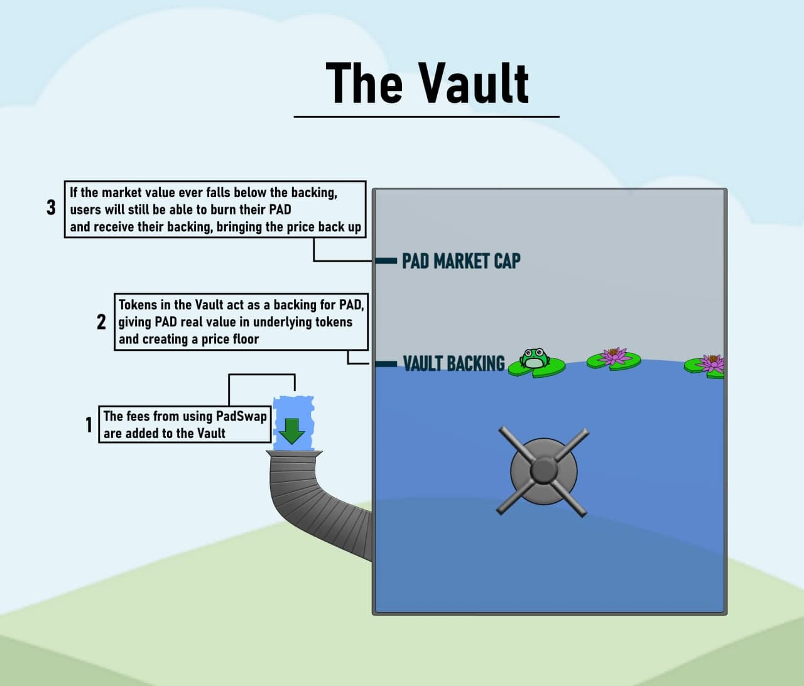

# 🔏 The Vault


PADSwap UI to view and interact with the Vault


**The Vault** is another groundbreaking idea for the whole TOAD.Network ecosystem. The Vault is a secure place that stores the backing for PAD, the native token of PADSwap.

Whenever a swap takes place on PADSwap, 0.05% of the transaction goes to [the Vault](https://dapps.padswap.exchange/vault/).\
The tokens accumulated in the Vault act as a backing for PAD, giving it real value in underlying tokens (such as BNB, BTC, ETH, etc.). Essentially, PAD is backed by small amounts of every token on [PADSwap](../products/padswap/), and the backing amount is growing with every transaction.

At any time, any holder can burn their PAD, permanently removing these tokens from the circulating supply, and receive their backing. For example, burning 1% of PAD supply will give you exactly 1% of every token stored in the Vault. If PAD's market cap ever drops below its Vault backing, it will become profitable to burn your PAD, which will in turn make PAD more scarce and thereby more valuable, bringing the price of PAD back up.

The Vault's purpose is to behave as an automated “price correction mechanism”, enabling holders to retrieve the corresponding amount of PAD tokens burned in the form of tokens held in the Vault at that moment.

It works like a water wheel on a river, or other constant perpetual motion machine. The more volume the more rewards, enticing more volume which brings more rewards.

## How The Vault works

In the future, when [the Vault](https://dapps.padswap.exchange/vault) is filled enough, if a big dump happens on PAD price, for some brief time the Vault will have a better exchange rate per PAD then PADSwap. Thus, there will be an opportunity for arbitrage on PAD price.

People can arbitrage by buying PAD on PADSwap and burning it to profit off this market condition.

When this happens, PAD price will go up influenced by standard AMM rules:

* increased buying pressure for the arbitrage
* supply decrease due to the burn

These two actions will be pushing the price above the backing price once again

In other words, we can see The Vault as a cross-chain index, forever-rising, floating peg.

In most AMMs, part of the swap fee goes towards Developer wallets. **But not here!** At PADSwap, this portion is aimed to further reward all users by sending 0.05% of each swap to the Vault where PADs’ backing value is held. This protects users from volatile market conditions.

It is a better rewarding feature than distributing dividends because PAD accumulates all historical profits + all future ones. Once someone buys PAD, they are not only buying PAD's future profits, but also all historic profits. This is superior to a token that simply directly pays dividends.

So, in short, The Vault is fed through fees from swaps, farms, and any additional inflows that get added over time. These fees are held in the vault and also used to buy other tokens to store in The Vault, effectively forming a crypto-index. If the open market price of PAD dips below its Vault backing price, users are incentivized to burn PAD to redeem their share of the Vault holdings.

## Redeem Backing

Let $V$ be the set of tokens in the Vault, $t_i \in V$ the amount of token $i$ in the Vault, $P$ the circulating supply of PAD, $p$ the amount of PAD supplied by the user, $l$ the leverage set by the community bound by $[1, 3]$, then we can define the redeem function $R$ as:

$$
R(p, t_i \in V) = \left( \dfrac{t_i}{P}\right) \cdot p \cdot l
$$

This function will be executed for all tokens in the vault $V$.

An example for burning Pad with easy numbers. Say the circulating supply of PAD is 100 PAD and you are holding 1 PAD which you want to burn, then you will get 1% (1/100) of all tokens in the Vault at that time. If there were 100 TOAD, 1 BTC, 10 ETH, and 1000 BUSD, you would get 1 Toad, 0.01 BTC, 0.1 ETH and 10 BUSD (ignoring transaction fees). The supply of PAD will be forever reduced to 99 and all future fees and value in the vault is now shared among fewer PAD tokens.
