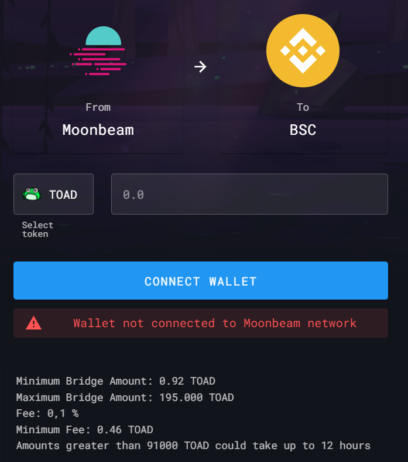
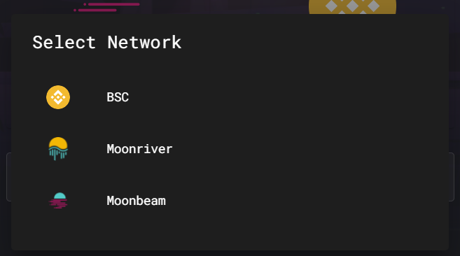
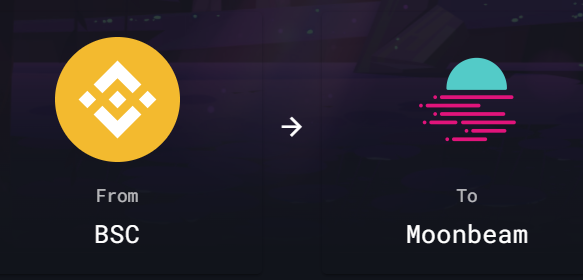
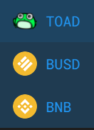
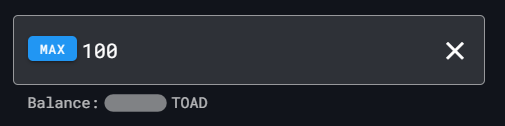
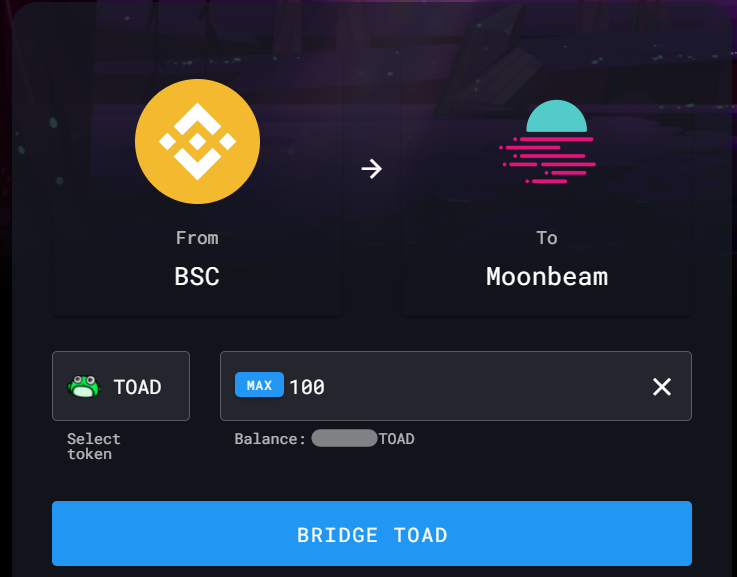

# How to Bridge Tokens?


**TL;DR**

Head to the bridge on PADSwap, select the chains you want to bridge and the token you want to bridge over as well as the amount. Click bridge and confirm the transaction with your wallet.


## Step 1: Navigate to Bridge on PADSwap

First you have to navigate to the bridge on the PADSwap platform trough the following link:


Bridge tokens from one chain to another on PADSwap


You should see the following screen:

## Step 2: Connect your Wallet

Connect your wallet to the site. In this guide we are using MetaMask.


At the moment, Trust Wallet does not support the Moonriver and Moonbeam chains. Use MetaMask instead.


## Step 3: Choose Chains to Bridge

Choose from which chain you want to bridge to which other chain.

In this example we will bridge tokens from the Binance Smart Chain (BSC) to Moonbeam (GLMR):

## Step 4: Select Token to Bridge

You can now select a token you want to bridge from the BSC to Moonbeam. In this example we will choose [toad.md](../fundamentals/tokens/toad.md "mention").

## Step 5: Enter Amount to Bridge

Set an amount of the selected token you want to bridge. In this example we will bridge 100 $TOAD. You can also press "MAX" to bridge all of your holdings of the selected token.

## Step 6: Perform Bridging of Tokens

### Step 6.1: Click Bridge

To bridge your tokens to the other chain, you need to click "BRIDGE":

### Step 6.2: Confirm Transaction

Your wallet will ask you to confirm the transaction. This will cost you a small fee.

## Step 7: View your Bridged Tokens

After the transaction went through (this might take some minutes), you should see your bridged tokens in your wallet. In your wallet, make sure to switch the chain to see your bridged tokens.


Congrats! You have now bridged your tokens onto another chain. On this chain you can now swap ([how-to-swap.md](how-to-swap.md "mention")), provide liquidity ([how-to-provide-liquidity.md](how-to-provide-liquidity.md "mention")) or farm ([how-to-farm.md](how-to-farm.md "mention")) on PADSwap.



If you bridged to a chain you were not on before, you are most likely missing the chain native token to pay gas fees for transactions. You can ask in our community on [telegram](https://t.me/toadnetwork), if anyone can lend you a small amount to cover for gas fees.

