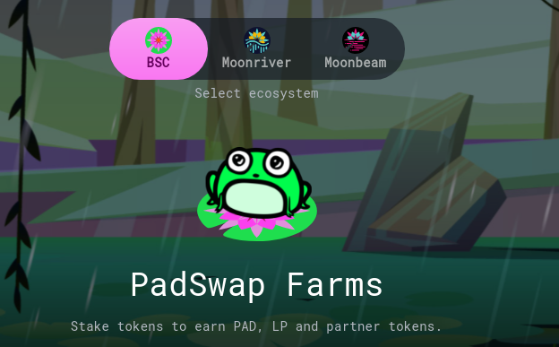
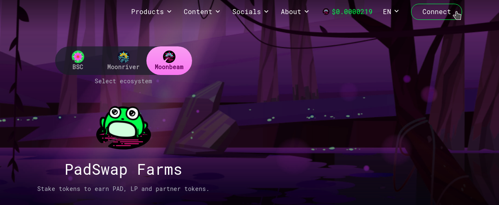
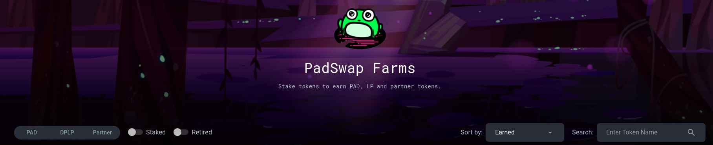
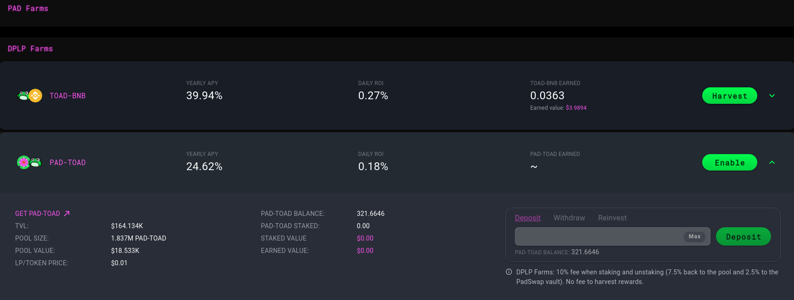
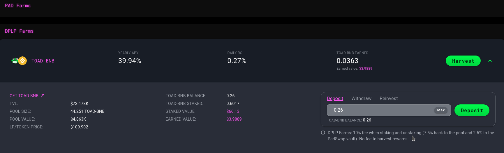
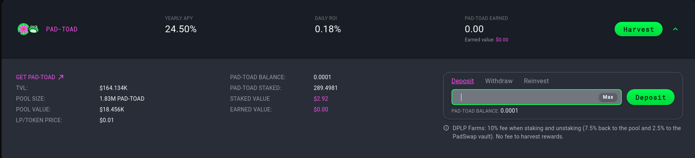

# How to Farm?


**TL;DR**

Head to the [farms](https://dapps.padswap.exchange) on PADSwap and choose a farm to stake your LP tokens in. Approve the farm and deposit the amount you want to stake.


## Step 1: Navigate to Farms on PADSwap

First you have to navigate to the farms on the PADSwap platform through the following link:


Farm PAD in our PAD Farms on PADSwap


## Step 2: Choose your preferred network

Select the chain where you have your LP tokens.

## Step 3: Connect your Wallet

Connect your wallet to the site. In this guide we are using MetaMask but you can use any other wallet like Trust Wallet.

## &#x20;Step 4: Choose a Farm Type

Choose in which type of farm you want to invest. For this guide we will go with the DPLP farms.


The **PAD, DPLP** and **Partner** farms have different rewards, reward sources and fees. See our [farms](../products/farms/ "mention") documentation for more information.


## Step 5: Choose your desired Farm

Choose a token pair to farm. For this guide we will go with the PAD-TOAD DPLP farm.


To farm a certain token pair you first need to provide liquidity for that token pair to receive the respective LP tokens to stake. See also our docs on [liquidity-pools.md](../products/padswap/liquidity-pools.md "mention") and our guide on [how-to-provide-liquidity.md](how-to-provide-liquidity.md "mention").


## Step 6: Approve the Farm Contract

### Step 6.1: Click Enable

For you to be able to deposit your LP tokens to the farm, you will need to approve the farm contract of your chosen farm first. Click on "enable" to approve the farm contract.

### Step 6.2: Confirm Approval

Your wallet will ask you to confirm the contract approval. This will cost you a small fee.

## Step 7: Deposit LP Tokens

### Step 7.1: Click Deposit

Once you have approved the contract in your wallet, you will be able to enter the amount of LP tokens you want to deposit. Enter the values and click on "Deposit" to deposit that amount to the farm.

Alternatively, you can use the "max" button to select all the amount of LP of the corresponding LP that you hold on your wallet.

### Step 7.2: Confirm Deposit

Your wallet will ask you to confirm the deposit. This will cost you a small fee.

## Step 8: View your LP tokens in the Farm

Once the transaction has been confirmed on the BSC, you will see your deposited LP tokens on the farm.


Congrats! You have now deposited your LP tokens into a farm and you'll be earning rewards by the second! You can continue by reading more about [farms](../products/farms/ "mention").

