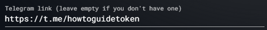

# How to Launch a Token?


**TL;DR**

Head to the [presale form on PADSwap](https://padswap.exchange/launch), connect your wallet, follow, fill the form and start your presale.


In this guide we will launch a presale for the token HTG deployed with the [how-to-create-a-token.md](how-to-create-a-token.md "mention") guide using PADSwaps token factory.

## Step 1: Navigate to the Presale Form on PADSwap

You have to navigate to the presale form through the following link:


Launch your own token on PADSwap via a presale.


## Step 2: Connect your Wallet

Connect your wallet to the site. In this guide we are using MetaMask.


At the moment, Trust Wallet does not support the Moonriver and Moonbeam chains. If you plan on launching a presale for a token on Moonriver or Moonbeam, then use MetaMask instead.


## Step 3: Select Chain

At the top of the page you can select the chain you want to launch a presale on. You can only launch the presale on the same chain that your token contract is deployed on.

In this guide we will choose Moonbeam since that is the chain the example token for this guide was deployed on.

.png>)

## Step 4: Fill the Presale Form

The presale form requires you to enter some details with respect to your token, your project and the presale. We will go through these details one by one.

### Step 4.1: Enter Token Contract Address

The first field ask you to enter the contract address of your deployed token. We will take the contract address of the HTG token deployed with the [how-to-create-a-token.md](how-to-create-a-token.md "mention") guide.

If you selected the correct chain and entered the correct contract address, the token details should be displayed like in the example below.

.png>)

### Step 4.2: Add Token Logo

Supplying a logo makes your presale look much nicer, so even though it is optional, we would recommend you to provide a token logo for your presale.

The field expects you to enter an image URL. This means you have to have your token logo uploaded to some hosting service. The best way is to host the token logo via the hosting provider of your projects website. An alternative could be to upload the image to your projects GitHub repository.

You can see that we have an image uploaded to the GitHub project of this documentation [here](../.gitbook/assets/TOAD%20-%20MoonBeam.svg).

.png>)

You should make sure to generate a permanent link which does not break after making changes to your repository. To get a permanent link, click on the menu and select "Copy permalink".

.png>)

To get a direct link (which you need) to the image, you need to click on "Raw".

.png>)

This will open the image in a new window. Go ahead and copy the image URL from your browsers URL field. In this example the URL is [https://raw.githubusercontent.com/ToadNetwork/Docs/a2a58feaf0ab356c95ff38bc23c15cdcaae81872/.gitbook/assets/TOAD%20-%20MoonBeam.svg](https://raw.githubusercontent.com/ToadNetwork/Docs/a2a58feaf0ab356c95ff38bc23c15cdcaae81872/.gitbook/assets/TOAD%20-%20MoonBeam.svg).

.png>)


The above URL is only an example for this guide. Please use your own logo and not this one.


You can now paste this image URL into the presale form field.

.png>)

If you see a preview of your logo on the right side of the logo URL field, then everything worked and you can continue with the next steps. If not, please contact the [community.md](../project/community.md "mention") to get help.

### Step 4.3: Reference Community

For the launch of your project you probably already gathered a cool community with people excited about your project.&#x20;


**Bring your own community.**

The Toad.Networks / PADSwap provides the tools and platform for your token launch and our [community.md](../project/community.md "mention") channels are there to help you launch your project by answering any questions you might have or helping with any problems you encounter.

BUT we do not provide marketing for your project. The Toad [community.md](../project/community.md "mention") will NOT fill your presale. Shilling your presale on our channels is NOT welcome.&#x20;

You have to build and bring your own community to fill your presale!


Telegram and Discord are common social platforms for crypto projects. We expect you to have one or both channels available. Please enter invite links to these channels so that investors finding your presale can connect with your community e.g. to ask questions they might have with respect to your project.

#### Step 4.3.1: Add Telegram Link

You can use your existing Telegram group if you have one or if not, you can follow our guide to create one or to make your existing one public.


[how-to-create-a-telegram-group.md](how-to-start-a-crypto-project/how-to-create-a-telegram-group.md)


We recommend you to use your groups public permalink which you can find on your TG group information.

.png>)

The TG group created as example for this guide has the following permalink: [https://t.me/howtoguidetoken](https://t.me/howtoguidetoken)


The above URL is only an example for this guide. Please use your own Telegram group link and not this one.


Alternatively, you can create an invite link to your private group and use that one. For this guide we will use the public group link.

Paste the URL to your Telegram group into the presale form field.

#### Step 4.3.2: Add Discord Link

Given you already have a Discord server for your community, you can get an invite link by pressing "Invite People" on your Discord server.

.png>)

Most likely you want to edit the invite link settings via the small link below "Edit invite link".

.png>)

You can choose to set your invite link to never expire and then generate a new invite link.

.png>)

For example the invite link generate in this guide looks like this: [https://discord.gg/XmDzR7z6qU](https://discord.gg/XmDzR7z6qU)


The above URL is only an example for this guide. Please use your own Discord server invite link and not this one.


Paste the URL to your Discord server into the presale form field.

.png>)

### Step 4.4: Add Website Link

Usually your project is about offering some service. To do so, you will need a website and/or dapp. If you already have one, we recommend you to enter the URL to it in the form field so that potential investors can look up more details about your project. If you do not yet have one, you could also share a link to your projects documentation or similar via this form field.

For this guide we will enter the URL of the main landing page of the Toad.Network.

.png>)


The above URL is only an example for this guide. Please use the URL of your own website and not this one.


## Step 5: Enable Referrals

PADSwap provides you with a referral program which your community can use to promote your projects presale.

Your community members sharing your presale can earn referral rewards which are taken from PADSwaps cut of the presale. Enabling the referrals has no negatives for you.

.png>)

You can read more about the referral program here:


[launchpad](../products/launchpad/)


## Step 6: Make Presale Public

You can decide if you want to make your presale public.

.png>)

If you decide to make your presale public, it will be listed on:


List of all presales.


## Step 7: Configure Presale

There are some parameters you need to specify for your presale. Note that a presale will be performed using the chain native token e.g. for BSC this is BNB or for Moonbeam this is GLMR.

### Step 7.1: Soft and Hard Cap

The hard cap specifies how much funds you want to raise with your presale. The soft cap specifies the minimum raised funds to let your presale succeed.


If the soft cap is not reached during the presale, the presale is canceled and all investors will be refunded.


For this example we will choose a very low hard cap to not unnecessarily spend funds for the sake of writing this guide. We will set a hard cap of 0.1 GLMR and a soft cap of 0.025 GLMR (which is 25% of the hard cap). This means that the community can spend up to 0.1 GLMR on the presale until it is successfully completed but at least 0.025 GLMR need to be invested or else it will be canceled.

.png>)

### Step 7.2: Duration

Set a maximum duration after which the presale will be concluded.

For this example we will go with the minimum of 12 hours. You will most like want to give your community more time to invest in your presale!

.png>)

### Step 7.3: Price

Relative to the set hard cap, you can specify a price for your token. This price will result in how many tokens you need to supply to the presale.


We recommend you to **supply 100%** of your token. This will give your community more trust that you will not dump the remaining supply on them after a successful launch.


For this example we will choose the price in a way that the number of tokens provided matches 100% of the token supply. You might need to adjust the price a bit to get the right amount.

.png>)

### Step 7.4: Maximum Contribution

The maximum contribution per user allows you to limit the maximum share of token supply investors can buy during your presale.


Protect your community!

Make sure to protect your presale from whales. If someone with deep pockets buys large junks of your presale, they hold a large share of your token supply. After the launch succeeded, they can then dump on / rug your community.


The following is a bad example of allowing an unlimited amount of contributions. It is only chosen for this example to fill the presale for the sake of this guide. DO NOT DO THIS.

.png>)

## Step 8: Approve Token Spending

Finally you can start your presale but first you will need to approve the spending of the token you want to supply for the presale. Press the "Approve YourToken" button to do that.

.png>)

You wallet will ask you to confirm this approval. This will cost you a small amount of Gas. Confirm to continue.

.png>)

## Step 9: Launch Presale

After the approval went through, you are now ready to launch your presale. Buy pressing "Launch" you will start the presale.

.png>)

Your wallet will ask you for confirmation. Besides Gas fees, this will also transfer the presale tokens and create the contracts. Confirm to launch your presale.

.png>)

## Step 10: View Presale

After the launch was confirmed on the blockchain, you should be redirected to your token's presale page. Go ahead an share the URL to the presale with your community and on socials.

If you set your presale to be public, you should also find your presale listed with all other presales on PADSwap: [https://padswap.exchange/allpresales](https://padswap.exchange/allpresales)

The list now also shows the presale launched as an example for this guide.

.png>)

If you did not set your presale as public, don't worry, you can change that, see [#step-12-manage-presale](how-to-launch-a-token.md#step-12-manage-presale "mention").

Let's now have a closer look at your just created presale.

The example presale is now available via this URL: [https://padswap.exchange/moonbeam/presale/0xEA1DD7E6dfDbC5Dcd9a597F50e96F9Db79307b8d](https://padswap.exchange/moonbeam/presale/0xEA1DD7E6dfDbC5Dcd9a597F50e96F9Db79307b8d)\
Your presale should have a similar URL.

On the presale page, you can see all the details you previously entered in the presale form.

.png>)

Below that, you got a time countdown for your presale which matches the time you specified in the presale form. Also you can see where your community can invest in your presale. The progress bar will show you how much your community already invested relative to the hard cap you specified.

.png>)

## Step 11: Inform Community About Referral Program

PADSwap provides your community with a referral program. 1% of every investment done through a referral link is automatically send to the referrer. Note that this 1% is taken from PADSwaps cut and not from yours. There is no negative aspect for you when your community uses the referral program. **You can use this to enable your community to do powerful marketing for you!**


As presale owner you should refrain from sharing your personal referral link. This is a feature for your community.


Hint your community at these. Everyone of your community members can use their own link like in the example below.

.png>)

## Step 12: Manage Presale

At the bottom of the presale you, the presale owner, can see some management options.


These UI options can only be seen by you, the presale owner.


You can edit the token info or cancel your presale if necessary.

.png>)

If something went wrong during the presale setup or you made changes in the meantime (e.g. you launched your own website), you can edit these details to update your presale. Here you can also make your presale public if you didn't before.

.png>)

## Step 13: Use Your DPLP Farm

The first one to claim their presale tokens will perform the operations to create the DPLP farm for your token (that one also will have to pay the respective Gas fees).&#x20;


Your DPLP farm will be created on the first claim of the presale tokens. If you see [http://padswap.exchange/bsc/farms?import=0x0000000000000000000000000000000000000000](http://padswap.exchange/bsc/farms?import=0x0000000000000000000000000000000000000000) as import URL for your farm, this means that no one yet claimed their tokens from the presale. After the first claim this URL will be updated.


This is how your successful presale should look like.

.png>)

At the bottom you will find the import URL for your DPLP farm contract. Share this with your community so that they can stake their LP tokens.

For example, the import URL of the the farm created with this guide: [http://padswap.exchange/moonbeam/farms?import=0x7882f7237A356a924cB2cB311B6dc992258D6e57](http://padswap.exchange/moonbeam/farms?import=0x7882f7237A356a924cB2cB311B6dc992258D6e57)

After a successful import your community should see your DPLP farm in the list of DPLP farms.

.png>)


Awesome! You performed your first presale with PADSwap.

