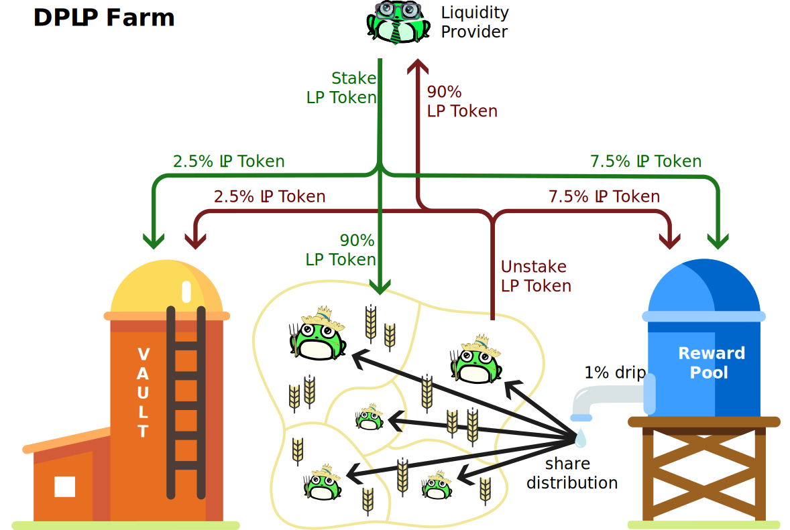

# ♾ DPLP Farms


Farm LP in our DPLP Farms on PADSwap


## DPLP

TOAD.Network invented the Decentralized Perpetual Liquidity Protocol (DPLP) as a mechanism which ensures that there is always an incentive for users to provide liquidity. This user provided liquidity is a big benefit for projects using DPLP; like TOAD, PAD and other projects launched on the [launchpad](../launchpad/ "mention").


This page focuses on the "incentive" aspect of DPLP, namely the DPLP farms. See [dplp.md](../../fundamentals/dplp.md "mention") for more details on the underlying concept.


## Rewards and Distribution

In DPLP farms you can earn LP tokens. This section describes, where these LP tokens come from and how they are distributed.

### Where do rewards come from?

Why should I care, you may ask. High APY is better, right? Not necessarily! See our notes on [#high-vs.-stable-apy](./#high-vs.-stable-apy "mention").

The rewards (APY) you see on the DPLP farms come from staking and unstaking fees. This ensures a continuous inflow of new rewards to the reward pool.

This works through the following two mechanisms:

1. The APY is a natural free market incentive for people to stake and reinvest their LP tokens on the DPLP farms, thereby increasing the reward pool (explained below).
2. Should the APY decrease or even dry up, people will naturally want to move their funds to other farms with higher rewards. The inevitable withdrawal of funds (unstaking) will in turn increase the reward pool. This increase in APY will trigger 1. again.

The interplay between 1. and 2. is a perpetual motion, always ensuring high APY.

Getting this perpetual motion going requires some initial reward pool funds. These are usually donated by the project owners (e.g. projects launched on [launchpad](../launchpad/ "mention")). For TOAD and PAD DPLP farms, Snake and KT donated around $200k to the initial reward pool funds. By a drip of 1% per day, the donated rewards are mostly depleted after 1 year (less than 3% left).

### How are rewards distributed?

The DPLP farm distributes 1% of the reward pool per day to all stakers relative to their pool share. The 1% per day is distributed in one second intervals. The default distribution percentage is 1%, which is currently used by all DPLP farms.


Rewards are not actively distributed and instead stay in the pool until they are claimed. The UI just calculates and shows your claimable rewards.


## Fees

When you stake, reinvest or unstake your LP tokens in a DPLP farm, you pay a 10% fee. From that 10%, 7.5% of the LP tokens are returned to the reward pool and 2.5% of the LP tokens are sent to [the-vault.md](../../fundamentals/the-vault.md "mention") as backing for [pad.md](../../fundamentals/tokens/pad.md "mention"). Harvesting your LP tokens does not incur a fee (except transaction fees).

The 'unstake' fee functions as a form of soft locking. It incentivizes you to keep your LP tokens staked for longer periods of time and therefore locking liquidity. But you are always free to withdraw your funds. See also our notes on [#no-vesting-less-risk](./#no-vesting-less-risk "mention").

## Contracts



* PAD-TOAD: [0x816ed1589b7783d7DD820bA4ebDef5899515dC76](https://bscscan.com/address/0x816ed1589b7783d7DD820bA4ebDef5899515dC76)
* KISH-BNB: [0xe70e0aBDa4FE7A744cCbCd8Ee5E7336477349555](https://bscscan.com/address/0xe70e0aBDa4FE7A744cCbCd8Ee5E7336477349555)
* CZATS-BNB: [0x73F41FB2121D4810316ba28f5fDC2EE07db28A1D](https://bscscan.com/address/0x73F41FB2121D4810316ba28f5fDC2EE07db28A1D)
* PXBSC-BNB: [0xE878bc2efA5961a515968F175568bc1AA6EE4C9F](https://bscscan.com/address/0xE878bc2efA5961a515968F175568bc1AA6EE4C9F)
* FUK-BNB: [0xe8d79DCc9B0B2285ac47EE9CCd4bE5925fB4B273](https://bscscan.com/address/0xe8d79DCc9B0B2285ac47EE9CCd4bE5925fB4B273)
* GAL-BNB: [0x00ae3d7eC0D75D0423BEffBCC7b53DaDA6aB04e4](https://bscscan.com/address/0x00ae3d7eC0D75D0423BEffBCC7b53DaDA6aB04e4)
* BJT-BNB: [0x51270eAF64D08b50858E385FA751e3C89cF27118](https://bscscan.com/address/0x51270eAF64D08b50858E385FA751e3C89cF27118)
* MRBTC-BNB: [0x50A90CbCBfb896306cC29f6EFef89f528Cf88E30](https://bscscan.com/address/0x50A90CbCBfb896306cC29f6EFef89f528Cf88E30)




Docs in progress





Docs in progress



