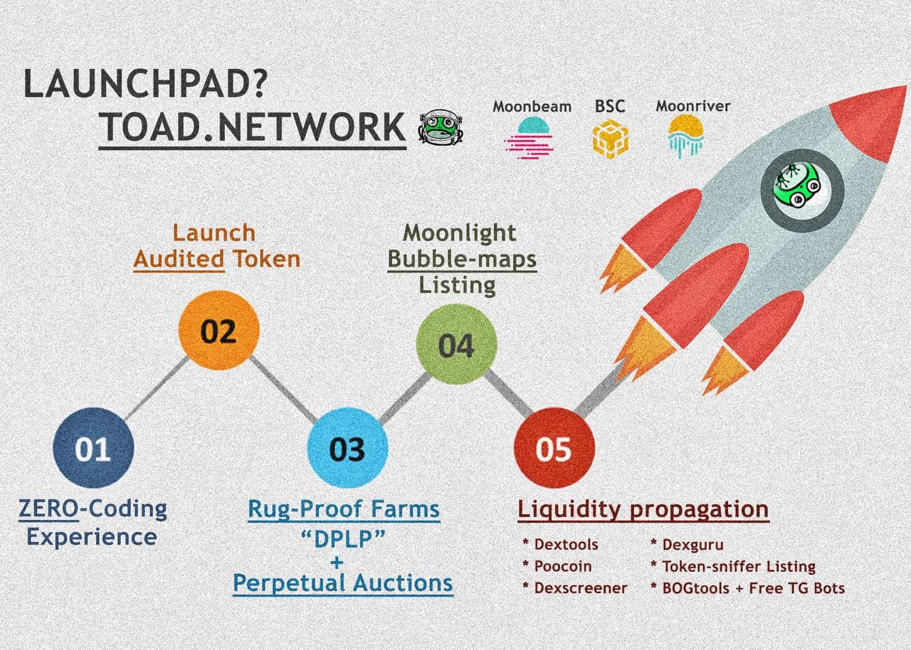

# 🚀 LaunchPAD


LaunchPAD on PADSwap


## What is the LaunchPAD?

The LaunchPAD is a service for projects to launch a token via a presale IDO. Users can participate in the presale to support the project.

The purpose of the LaunchPAD is to make token launches as safe as possible for users and as easy as possible for developers. Take care of your community and let TOAD handle the rest! LaunchPAD also offers a large variety of tools to boost projects' liquidity and utility. We believe developers should be able to focus entirely their products and the community as we know first hand how many obstacles there can be in this space to growth. We hope to set an industry standard where users feel safe that Developers will not be able to rug or act maliciously with LP. Obviously, this is not a magic solution- some projects that do not offer anything new are still going to only perform as well as the market allows. However, this is leaps above current protocols and eliminates rug pulling altogether.

The LaunchPAD provides a [token-factory.md](token-factory.md "mention") for a zero coding deployment of your token.

You can launch your token on PADSwap via a [token-presale.md](token-presale.md "mention"), where your community can invest in your project. We provide you the presale systems, a referral program to promote your presale and after your successful launch, we automatically set up [liquidity-pools.md](../padswap/liquidity-pools.md "mention") and your projects [dplp-farms.md](../farms/dplp-farms.md "mention").

## Referral Programs

There are two referral programs, one for project referrals and one for presale referrals.

### Project Referrals

If you refer a project to launch their token on PADSwaps launchpad, you are rewarded with 1% of the total presale investments! The 1% referral reward is cut from PADSwaps 4% platform fees and is not taken from the project or investor.

The project referral reward is only payed out if the following conditions are met:

* Proof of referral: You have to have contacted one of our [core team](../../project/team.md) **prior** to the project launching on PADSwap or/and the project owner can confirm your referral.
* Successful presale: The tokens presale on PADSwaps launchpad needs to have at least reached the soft-cap.
* No project relation: You are not the project owner and not a project team member except if you can prove that you convinced the project owner to choose PADSwap over other options.


Paying out the project referral reward is a manual process and you need to claim it from our [core team](../../project/team.md). While we have no interest in withholding rewards for a valid claim, you should be aware that there is no guarantee and that PADSwap has no obligation to pay out the reward.


### Presale Referrals

If you refer someone to an on-going presale through your referral link, you will earn 1% of their presale investments. The 1% referral reward is cut from PADSwaps 4% platform fees and is not taken from the project or investor.

## Future Development

The docs show the current state of the launchpad. For example, but not limited to, the following features are planned in the future:

* Have all possible token contracts audited so that all launching tokens are audited from the get go.
* Have the presale contract audited
* AUDITED Farms (TOKEN-BNB|MOVR|GLMR, TOKEN-BUSD|USDC, TOKEN-PAD)
* Partner Farms available for whitelisted Projects
* Auction Contract
* Full set of free BOGtools, Chart, Limit Orders, Telegram Bot
* Discounted Moonlight Bubble Maps List
* Free Unifaucet List for reflections.
* [Token Sniffer](https://tokensniffer.com) Listing
* And more...

