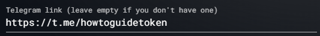

# 🌺 PAD

****.png>)****

**PADSwap Token Name:** Lily Pad

**PADSwap Token Symbol/Ticker:** PAD

**Max Supply:** 200 billion

**Pre-mint:** 10 billion

**Liquidity (PERMANENTLY LOCKED):** **400,000 busd** at start; **200,000 busd** in pre-minted PAD, **200,000 busd in TOAD donated by Snake and KingToad**

**No Presale**

**Fair Launch (**Devs only get 10% of the 0.13% drip per day,** NO TEAM TOKENS AT LAUNCH**)

 (1).png>)

The BEP-20 token PAD is a standard BEP-20 token with mint and burn functions, the mint function can only be used by the minter contract.

The minter mints new tokens(0.13% of the remaining supply there is to mint) and distributes them to the farms. All of the remaining 180 billion tokens are going to be minted and distributed by the Minter contract. The minter contract will mint 0.13% of the remaining supply a day, by the second, and distribute those rewards to the farms and dev contract.

The dev contract will get 10% of those rewards, the remaining 90% are going to be distributed to the farms. The only address that is allowed to mint new tokens is the minter contract. The only parameters the developers can change in the minter contract are the % each farm gets from the daily mint and add/remove new farms. Developers have no incentive to alter the % they get from the minter, as this would be quickly spotted by the community and since the Minter contract will only mint 0.13% a day, they would lose more from the devaluation (due to lost of trust) of the pad and toad that they hold than that 0.13% is worth.

\

**2.1 Continuous Minter Fomula**

Let **M **= remaining supply = 190 billion after the initial 10 billion mint

**s **= seconds passed since last mint time

**r** = % drip per second 0.0013% a day / 86400 seconds

The total minted formula after s seconds can then be represented as the **continuous recursive function** from time **s **in seconds after the initial mint

.png>)=Current remaining supply after s seconds

**Note: **you can derive the total tokens minted after **s **seconds by taking 180,000,000,000 – F(s) after solving the recursive formula for a given time in seconds.

[The **Vault**](the-vault.md)** **stores pad backing, developers can add support for a new token to it, if a user wants to redeem the backing of PAD, the vault will burn that amount of PAD. Lowering PAD supply forever.

\

**2.1 Why a Vault?**

Why create a vault that stores value as backing for PAD instead of distributing dividends for people staking PAD?

\
The most important point is persistent vs. non-persistent rewards. One of the biggest problems of distributing those fees as dividends to token holders is that the value generated by those fees are not persistent. That means the value is distributed to holders, but those holders can sell the token later and keep those rewards they already earned. On this new vault model, those rewards are persistent: ‘If a user sells PAD he is also selling the right to redeem its backing, and the new user buying it is also receiving all the historical rewards already collected’, in the case of a dividend distribution the only value of the token to the new user would be the future fees it will generate. This is a good question and the answer is not simple as there are multiple reasons why this new vault model is way superior.\
It creates a floor price. It helps reduce the PAD supply in case the price of PAD dumps below its backing value there is an incentive to buy PAD to burn and redeem the backing. This arbitrage trade will not only benefit the person doing it, but also PAD, as it will reduce the supply of PAD and push the price up from the buy.

It is flexible. One of our long term goals is to create a DAO. Where the toad token will serve as the governance token (it is scarce, hard to farm, has a fixed max supply) and pad as the utility token. The vault can be integrated with the DAO and the community can vote in which tokens they want to add. Giving this organization the ability to search for upcoming projects and invest in them using the trading fees. This can turn PAD into an index token, pegged to multiple tokens and managed by a decentralized organization.\
The community will also be able to vote on the % of each token to buy with the fees generated, this gives the vault the ability to adapt its strategy during bull/ bear markets. EX: The vault can buy more USDC while the markets are up and buy more BTC when the markets crash.

Benefits to TOAD holders: Lots of farms for TOAD pairs. 10 days farming exclusivity (only TOAD related farms). Vault buys 30% of the fees generated in TOAD and stores them, removing tokens from circulation. Increase TOAD liquidity (with lots of new TOAD farms we can expect the amount of liquidity to increase a lot)
