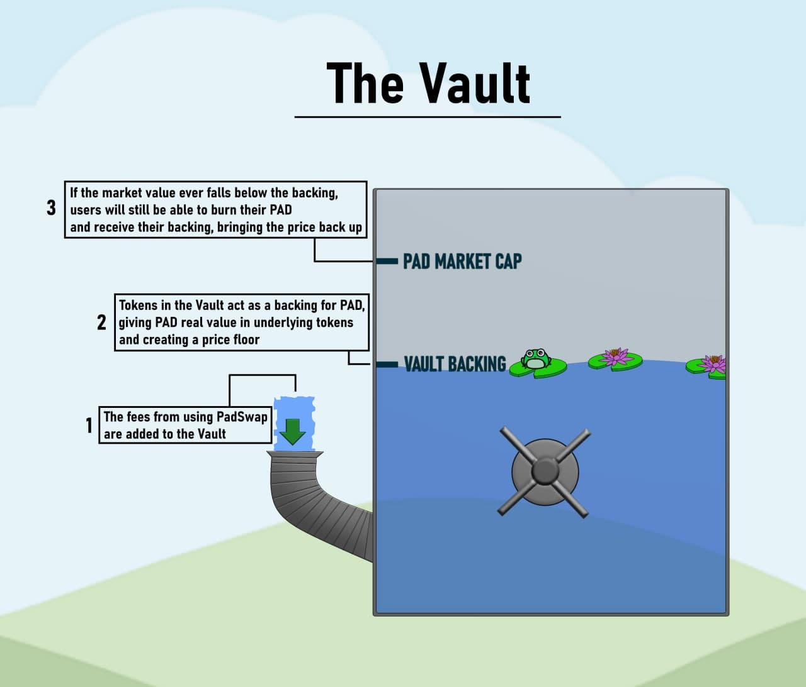

# 🔏 The Vault

**The Vault** is another groundbreaking idea for the whole TOAD.Network-PADSwap ecosystem. The Vault is a secure place that stores the backing for PAD, the native token of PADSwap.

Whenever a swap takes place on PADSwap, 0.05% of the transaction goes to [The Vault](https://dapps.padswap.exchange/vault/).\
The tokens accumulated in The Vault act as a backing for PAD, giving it real value in underlying tokens (such as BNB, BTC, ETH, etc.). Essentially, PAD is backed by small amounts of every token on [PADSwap](broken-reference), and the backing amount is growing with every transaction.

At any time, any holder can burn their PAD, permanently removing these tokens from the supply, and receive their backing. For example, burning 1% of PAD supply will give you exactly 1% of what's stored in The Vault. If PAD's market cap ever drops below its Vault backing, it will become profitable to burn your PAD, which will swiftly bring the market PAD price back up.

The Vault's purpose is to behave as an automated “price correction mechanism”, enabling holders to retrieve the corresponding amount of PAD tokens burnt in the form of the LP Tokens held in The Vault at that moment.

“It works like a water wheel on a river, or other constant perpetual motion machine. The more volume the more rewards, enticing more volume which brings more rewards.”

**How The Vault works**

In the future, when [the Vault](https://dapps.padswap.exchange/vault) is filled enough, if a big dump happens on PAD price, for some brief time The Vault will be paying more than the value of PAD on PADSwap. Thus, there will be an opportunity for arbitrage on PAD price.

People can arbitrage by buying PAD on PADSwap and burning it to profit off this market condition.

When this happens, PAD price will go up influenced by standard AMM rules:

* increased buying pressure for the arbitrage
* supply decrease due to the burn

These two actions will be pushing the price above the backing price once again

In other words, we can see The Vault as a cross-chain index, forever-rising, floating peg.

In most AMMs, part of the swap fee goes towards Developer wallets. **But not here!** At PADSwap, this portion is aimed to further reward all users by sending 0.05% of each swap to the The Vault where PADs’ backing value is held. This protects users from volatile market conditions.

It is a better rewarding feature than distributing dividends because PAD accumulates all historical profits + all future ones. Once someone buy PAD, they are not only buying PAD's future profits, but also all historic profits. This is superior to a token that simply directly pays dividends.

So, in short, The Vault is fed through fees from swaps, farms, and any additional inflows that get added over time. These fees are held in the vault and also used to buy other tokens to store in The Vault, effectively forming a crypto-index. If the open market price of PAD dips below its Vault backing price, users are incentivized to burn PAD to redeem their share of The Vault in the form of the LP tokens held there.

An example for burning Pad with easy numbers. Say there are 100 PAD in existence and I choose to burn 1, I will get 1% (1/100) of whatever is in The Vault at that time. If there were 100 Toad, 1 BTC, 10 ETH, and 1000 BUSD, I would get 1 Toad, 0.01 BTC, 0.1 ETH and 10 BUSD. The supply of PAD is forever reduced and all future fees and value in the vault is now shared among fewer tokens.

## Redeem Backing

Let T = Set (list) of backing tokens in the vault

ti = Select backing token balance in the vault

p0 = Current PAD supply

bu = Burn amount of PAD supplied by the user

l0 = (3 >= l0 >= 1) Leverage determined by markets and the community

We can represent this by the function **F(bu **, **T)** with **bu** being the burn amount of PAD supplied by a user and the set **T** being the backing tokens stored in the vault.

(currently bBTC, bETH, bUSDC, TOAD, and TOAD-PAD LP)

\
.png>)

This function will be repeated for all token values in the vault T, which is currently 5 times to redeem the backing of the 5 tokens when PAD is burned.
