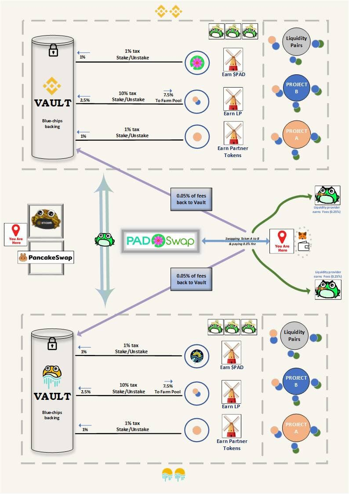

# 👩🌾 Yield Farming

## What is Yield Farming?&#x20;

Yield farming in the cryptoverse refers to the performance of a particular action for a platform or entity that justifies paying out an annualized percentage yield (APY). Often, this effort entails adding liquidity to a network, and then staking liquidity provider tokens, or adding liquidity to a market for borrowing and lending. Projects incentivize this behavior when it enables them to function more efficiently.&#x20;

TOAD.Network has the most effective system in DeFi for farming yield. This is in part because nearly every token on PADSwap is natively yield bearing, which enables TOAD to function very efficiently. In TOAD's case, adding liquidity to any branch of the platform allows the platform as a whole to be more efficient, and every type of market is available on PADSwap.

Yield farming calculator has been created and can be found in the [Toolbox](https://toad.academy/toolbox/) of [**TOAD Academy**](../toad-academy.md)**.**

