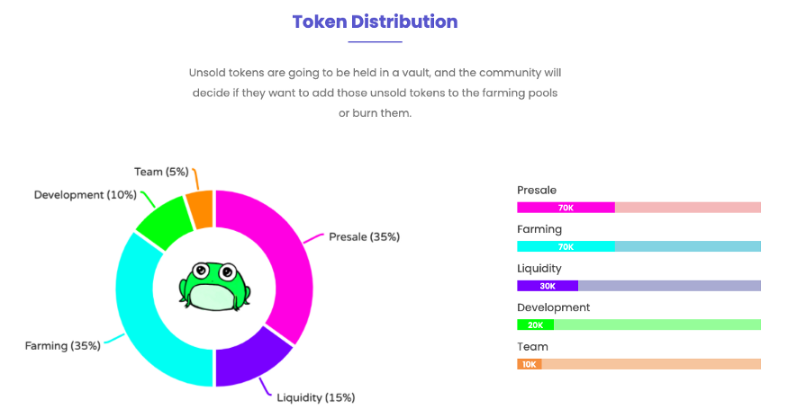

# 🐸 TOAD

&#x20;The Toad Team created a contract that will allow Toad liquidity providers to stake their LP tokens to farm LP tokens in a perpetual farm that is never running out.

The Toad Team decided to add all the liquidity provider tokens to the farm pool, getting them out of the team hands, thus effectively removing our ability to remove liquidity, and making toad a **“Rug Pull Proof**” project. This was the birth of DPLP

**TOAD Token**

Toad token was released on the BSC on Friday, 26th of February 2021 with a fixed amount of 200.000 TOAD tokens. At launch 5,000 were burnt.

There is no possibility to mint more TOAD.

Conceived as a governance token, has a very low supply, and will see significant buyback pressure from The Vault.

TOAD aims to empower the [TOAD.Network](broken-reference) community to participate in the protocol decisions, like:

• Bring and vote on new proposals.

• Determine fee ratios directed to both the Vault and farms/pools rewards.&#x20;

• Marketing / Development endeavors.

