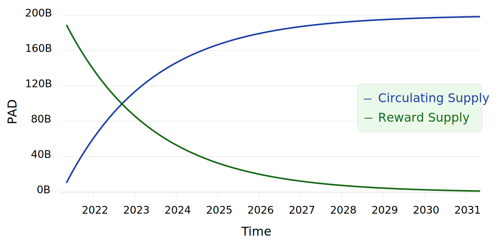
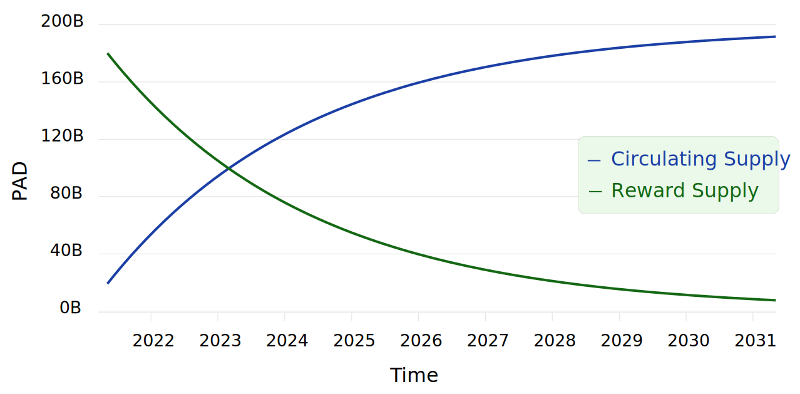

# 🌺 $PAD

| Name          | Lily Pad                                   |
| ------------- | ------------------------------------------ |
| Symbol/Ticker |  PAD |

## Contracts



[0xc0888d80ee0abf84563168b3182650c0addeb6d5](https://bscscan.com/token/0xc0888d80ee0abf84563168b3182650c0addeb6d5)



[0x45488c50184ce2092756ba7cdf85731fd17e6f3d](https://moonriver.moonscan.io/token/0x45488c50184ce2092756ba7cdf85731fd17e6f3d)



[0x59193512877E2EC3bB27C178A8888Cfac62FB32D](https://blockscout.moonbeam.network/address/0x59193512877E2EC3bB27C178A8888Cfac62FB32D)



## Usage

PAD is the native token of PADSwap. It acts as basis of many farms, is used as staking reward in PAD farms and provides a share for development funds.

## Tokenomics

| Max Supply                                 | 200 billion                                                                 |
| ------------------------------------------ | --------------------------------------------------------------------------- |
| Burn                                       | Yes, on claim of [the-vault.md](../concepts/the-vault.md "mention") backing |
| Fees / Tax (on sell, buy and transactions) | 0%                                                                          |

Launch Details:



* Launch Date: May 8, 2021 03:58:26 AM (UTC)
* Pre-mint: 10B
* Liquidity (Permanently locked): 200k BUSD in pre-minted PAD donated by Snake and KingToad
* Fair Launch: No Presale and no dev / team tokens at launch



* Launch Date: Nov 1, 2021 04:22:42 AM (UTC)
* Pre-mint: 20B
* Fair Launch: No Presale and no dev / team tokens at launch



* Launch Date: January 1, 2022
* Presale price: 833K PAD per GLMR (6000 GLMR hardcap)
* Fair Launch: No Presale and no dev / team tokens at launch



PAD is a standard token with mint and burn functions, the mint function can only be used by the minter contract. The minter mints an exponentially decreasing percentage of the remaining supply and distributes them to the [pad-farms.md](../products/farms/pad-farms.md "mention") and development funds. See [#continuous-minter-formula-pad-drip](pad.md#continuous-minter-formula-pad-drip "mention") for details on the minter.

On every chain PAD is created independently and has its own [the-vault.md](../concepts/the-vault.md "mention").

.jpg>)

Of the daily drip, 90% are distributed to the [pad-farms.md](../products/farms/pad-farms.md "mention") and 10% are sent to the development funds. The only address that is allowed to mint new tokens is the minter contract. The only parameters the developers can change in the minter contract are the percentage each farm gets from the daily drip and add/remove new farms. Developers have no incentive to alter the percentage they get from the minter, as this would be quickly spotted by the community and since the minter contract will only mint a small fixed percentage a day, they would lose more from the devaluation (due to lost of trust) of the PAD and TOAD that they hold than they could gain.

[the-vault.md](../concepts/the-vault.md "mention") stores PADs backing, if a user wants to redeem the backing of PAD, the vault will burn that amount of PAD. Lowering PAD supply forever. Making PAD a deflationary token with a rising price floor, continuously increasing the backing and decreasing the supply.


See [the-vault.md](../concepts/the-vault.md "mention") for more details.


## Continuous Minter Formula / PAD drip

Let $$p$$ be the drip pool supply, $$d$$ the drip per second with 86400 seconds per day and $$s$$ the duration in seconds, then the exponential decay of the drip pool is given by the function $$M$$:

$$
M(p, d, s) = p * \left(1 - \dfrac{d}{86400}\right) ^ s
$$

The function $$M$$ calculates the remaining drip pool supply after $$s$$ seconds. For example, if we want to calculate the remaining PAD in a drip pool of 190B after 1 year (31,536,000 seconds) with a drip of 0.13%, we can solve $$M(190\text{B}, 0.0013, 31536000)$$, which gives us 118B PAD remaining in the drip pool after a year.

To calculate the remaining PAD you need the drip pool supply, the drip percentage and the timestamp of contract deployment for the respective chains:



PAD has a max supply of 200B tokens and there was an initial mint of 10B tokens, so $$p = 190\text{B}$$.

PAD has a drip of 0.13%, so $$d = 0.0013$$.

Deployment of the contract was on May 8, 2021 03:58:26 AM (UTC). To calculate the duration $$s$$ you need to calculate the duration from that time to your desired time in seconds. You can use [this calculator](https://www.calculator.net/time-duration-calculator.html?today=05%2F08%2F2021\&starthour2=3\&startmin2=58\&startsec2=26\&startunit2=a#twodates) to calculate the duration in seconds.




PAD has a max supply of 200B tokens and there was an initial mint of 20B tokens, so $$p = 180\text{B}$$.

PAD has a drip of 0.09%, so $$d = 0.0009$$.

Deployment of the contract was on Nov 1, 2021 04:22:42 AM (UTC). To calculate the duration $$s$$ you need to calculate the duration from that time to your desired time in seconds. You can use [this calculator](https://www.calculator.net/time-duration-calculator.html?today=11%2F01%2F2021\&starthour2=4\&startmin2=22\&startsec2=42\&startunit2=a#twodates) to calculate the duration in seconds.





Docs in progress




## $PAD in Perspective

PADSwap competes with other Dex on the market. Comparing the market cap of PADSwaps native token $PAD to the market cap of the native tokens of other Dex can give you a perspective on the potential of the $PAD price.

| Dex            | Potential Price per $PAD | Potential Upside of $PAD |
| -------------- | ------------------------ | -----------------------: |
| Uniswap        | $0,13289                 |                   x23841 |
| PancakeSwap    | $0,03685                 |                    x6611 |
| CurveFinance   | $0,03245                 |                    x5822 |
| SushiSwap      | $0,01413                 |                    x2535 |
| Bancor Network | $0,00957                 |                    x1716 |
| Raydium        | $0,00647                 |                    x1160 |
| MDEX           | $0,00399                 |                     x715 |
| SunSwap        | $0,00285                 |                     x511 |
| Balancer       | $0,00162                 |                     x290 |
| QuickSwap      | $0,00132                 |                     x237 |

_The calculation is based on data from 02.01.2022. The underlying market cap data of the Dex tokens was taken from_ [_coinmarketcap.com_](https://coinmarketcap.com)_. The $PAD market cap was assumed to be_ $457,068 _based on a price of_ $0,0000055740 _and a circulating supply of 82B after 356 days of drip._
